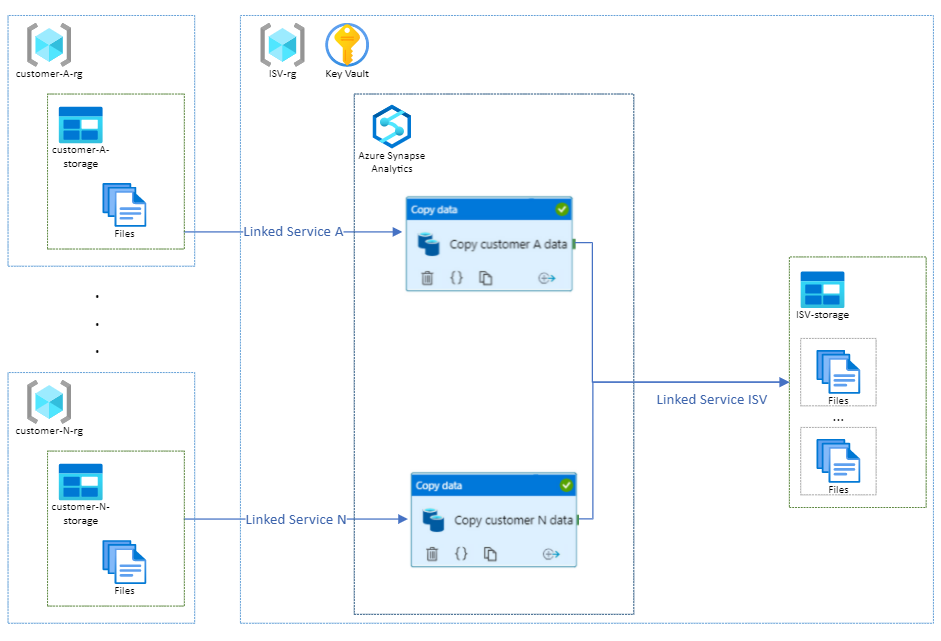
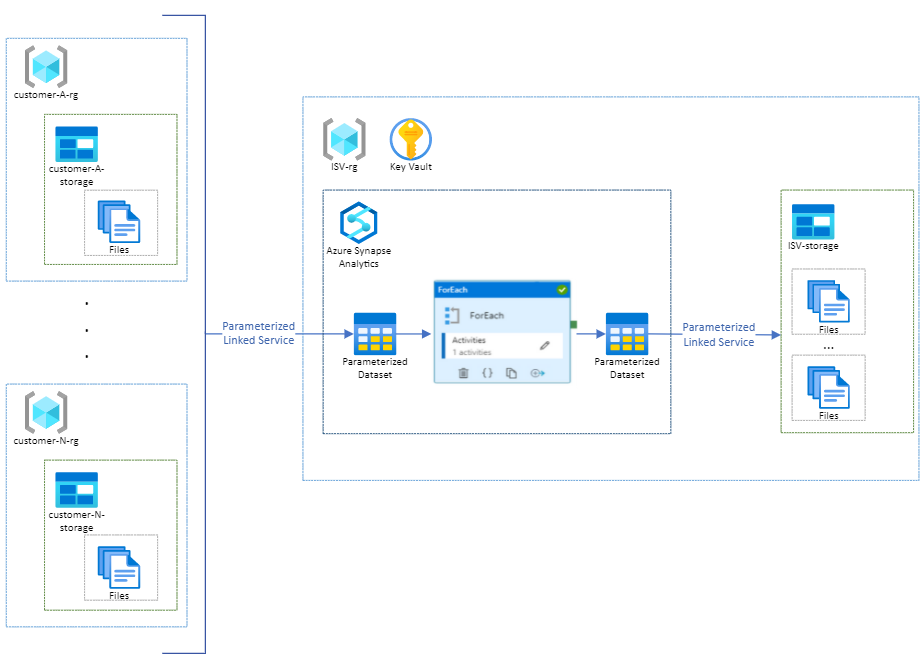
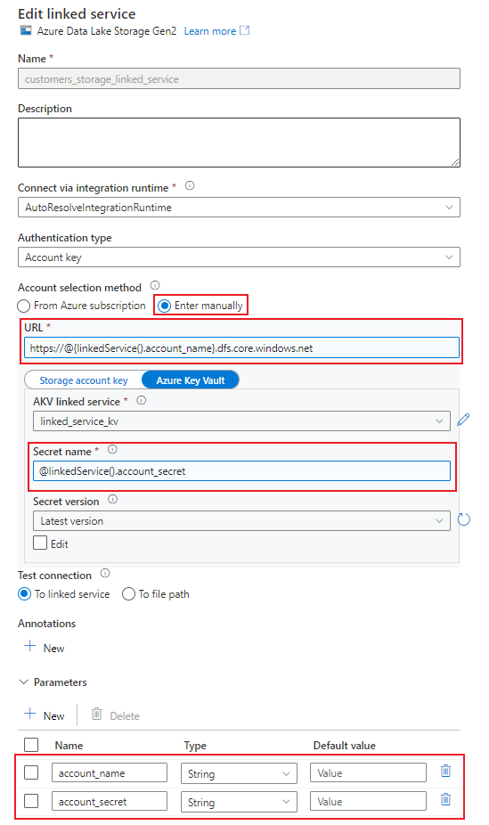
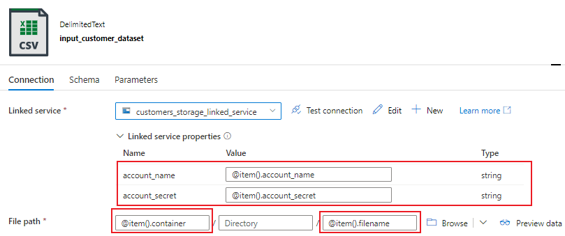
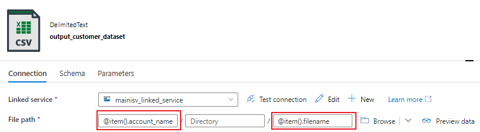

# Use Case

As an ISV with multi-tenant solution that pulls data from multiple similar sources throught different connection strings, you might be able to leverage a single ADF/Synapse pipeline which would differ only in parameter values.

> tl;dr This sample demonstrates the creation of parametrized linked-services and datasets, enabling the use of a single pipeline definition to access multiple sources / targets.



## Target architecture

 To minimize the operational overhead of on-boarding new customers, we will create a single pipeline with a parameterized linked service and dataset, configured during runtime, that will be used to access all the different storage accounts.



## Create pipeline and activities

For this sample, we will pull the data from each customer storage and save it in the ISV storage. To do that a ```Copy()``` activity will be defined inside a ```ForEach()``` activity that will iterate over an array of customers.

> Usually, the list of customers is retrieved from a control table. To keep this sample more generic, the list of customers was hardcoded in a pipeline parameter.

The array of customers follows the bellow format:

```bash
customers = [
    {
        "account_name": "customerastorage",
        "account_secret": "customer-a-storage-secret-1",
        "container": "data",
        "filename": "customer_a.csv",
        "target_container": "customer_a"
    },
    {
        "account_name": "customerbstorage",
        "account_secret": "customer-b-storage-secret-1",
        "container": "data",
        "filename": "customer_b.csv",
        "target_container": "customer_a"
    }
]
```

1. Create a pipeline.
2. Create a pipeline parameter called ```customers``` where the value is the Array of customers with all the information to access and store the customers files.
3. Add a ```ForEach()``` activity to the pipeline and under Settings pass the customers Array, stored in ```@pipeline().parameters.customers```, to ```Items```.
4. Add a ```Copy()``` activity to the ```ForEach()```.

## Create a parameterized linked service

1. Create a new linked service and add the parameters ```account_name``` and ```account_secret```, that will be populated during runtime to access each customer storage.
2. Select the 'Enter manually' method.
3. Click on the URL text box and select the **Add Dynamic Content** option that will be displayed bellow the text box. Enter the account URL manually and replace ```<accountname>``` with the linked service parameter ```account_name```.
4. Select the Key Vault that stores the secrets of the customers accounts and assign the linked service parameter ```account_secret``` to Secret name.
5. In case you want to parameterize the linked service to the target account, create a new linked service and repeat the previous steps.

> Do not parameterize passwords or secrets. Store all secrets in Azure Key Vault instead, parameterize the Secret Name.



## Create parameterized datasets

### Input Dataset

1. Create a dataset.
2. Select the parameterized linked service to access the different accounts.
3. Define the linked service properties/parameters. In this sample, account and Secret will be retrieved from the current loop ```item``` during runtime.
4. Define the path to access the files. Container, Directory an Filename will be retrieved from the current ```item``` during runtime.
5. Define this dataset as Source dataset of the ```Copy()``` activity.



### Output dataset

1. Create a dataset.
2. Select the linked service to access the ISV storage.
3. Specify the path where the files should be saved. In this sample, each customer files will be saved in a different container. The values for the target container, directory and filename will be retrieved from the current loop ```item``` during runtime.
4. Define this dataset as Sink dataset of the ```Copy()``` activity.


