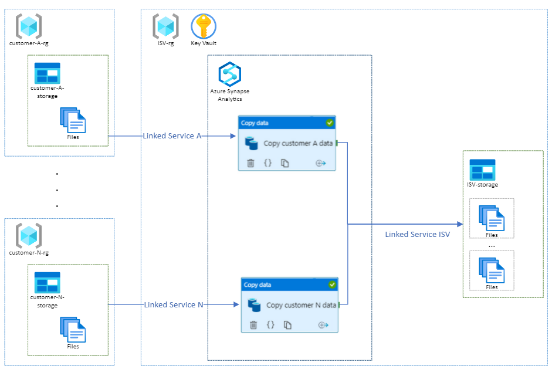
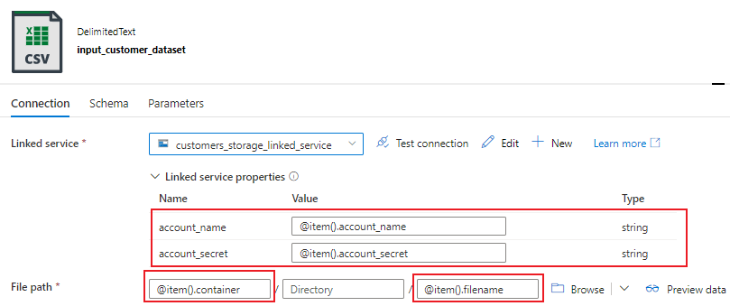

<h1>Use Case</h1>

As an ISV with multi-tenant solution that pulls data from multiple similar sources throught different connection strings, you might be able to leverage a single ADF/Synapse pipeline which would differ only in parameter values. 

|  |
|:-:|
| Fig.1 - Use case architecture.|

<br></br>
<h1>Target architecture</h1>

 To minimize the operational overhead of on-boarding new customers, we will create a single pipeline with a parameterized linked service and dataset, configured during runtime, that will be used to access all the different storage accounts.


|  |
|:-:|
| Fig.2 - Target architecture.|


<br></br>
<h2>Create pipeline and activities</h2>

For this sample, we will pull the data from each customer storage  and save it in the ISV storage. To do that a ```Copy()``` activity will be defined inside a ```ForEach()``` activity that will iterate over an array of customers.

**NOTE:** Usually, the list of customers is retrieved from a control table. To keep this sample more generic, the list of customers was hardcoded in a pipeline parameter.

The array of customers follows the bellow format:

```
customers = [
    {
        "account_name": "customerastorage",
        "account_secret": "customer-a-storage-secret-1",
        "container": "data",
        "filename": "customer_a.csv",
        "target_container": "customer_a"
    },
    {
        "account_name": "customerbstorage",
        "account_secret": "customer-b-storage-secret-1",
        "container": "data",
        "filename": "customer_b.csv",
        "target_container": "customer_a"
    }
]
```

1. Create a pipeline.

2. Create a pipeline parameter called ```customers``` where the value is the Array of customers with all the information to access and store the customers files.

3. Add a ```ForEach()``` activity to the pipeline and under Settings pass the customers Array, stored in ```@pipeline().parameters.customers```, to ```Items```.

3. Add a ```Copy()``` activity to the ```ForEach()```.


<br></br>
<h2>Create a parameterized linked service</h2>

1. Create a new linked service and add the parameters ```account_name``` and ```account_secret```, that will be populated during runtime to access each customer storage.

2. Select the 'Enter manually' method.

3. Click on the URL text box and select the **Add Dynamic Content** option that will be displayed bellow the text box. Enter the account URL manually and replace ```<accountname>``` with the linked service parameter ```account_name```.

4. Select the Key Vault that stores the secrets of the customers accounts and assign the linked service parameter ```account_secret``` to Secret name. 


**NOTE:** Do not parameterize passwords or secrets. Store all secrets in Azure Key Vault instead, parameterize the Secret Name.

<br></br>

|  |
|:-:|
| Fig.3 - Parameterized linked service to connect to the customers storages.|


<h2>Create parameterized datasets</h2>

<h2>Input Dataset</h2>

1. Create a dataset.

2. Select the parameterized linked service to access the different accounts.

3. Define the linked service properties/parameters. In this sample, account and Secret will be retrieved from the current loop ```item``` during runtime. 

4. Define the path to access the files. Container, Directory an Filename will be retrieved from the current ```item``` during runtime. 

5. Define this dataset as Source dataset of the ```Copy()``` activity.


|  |
|:-:|
| Fig.4 - Create a parameterized dataset to access the files contained in the customers storages.|

<br></br>
<h2>Output dataset</h2>

1. Create a dataset.

2. Select the linked service to access the ISV storage.

4. Specify the path where the files should be saved. In this sample, each customer files will be saved in a different container. The values for the target container, directory and filename will be retrieved from the current loop ```item``` during runtime. 

5. Define this dataset as Sink dataset of the ```Copy()``` activity.


|  |
|:-:|
| Fig.5 - Create a parameterized dataset to write the customers files in the ISV storage.|